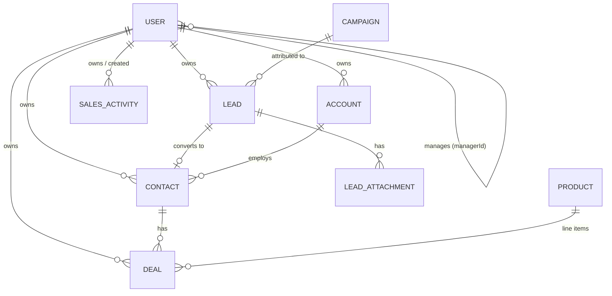

# SalesForce MVP — Full Application Documentation

A frontend-only MVP of a sales workforce CRM, built to showcase the complete
sales operation of an Indian sales organisation: lead capture (online and
offline) → qualification → conversion → pipeline → secured order, with
hierarchy-based access control, activity management, targets, campaigns,
accounts and reporting.

Everything runs in the browser against a seeded, localStorage-backed data
store. There is **no backend** — by design. Every store mutation maps 1:1 to
a future API endpoint, so the app doubles as a living specification.

---

## 1. Technology stack

| Layer | Choice | Version | Notes |
|---|---|---|---|
| Framework | Next.js (App Router) | 14.2.35 | Mirrors the madenkorea-production reference app |
| UI runtime | React | 18.2.0 | |
| Language | TypeScript | 5.2.2 | `strict: true`; `@/*` path alias |
| Styling | Tailwind CSS | 3.3.3 | shadcn/ui conventions, CSS-variable theming |
| Components | shadcn/ui-style + Radix primitives | — | Hand-written subset in `components/ui` |
| Icons | lucide-react | ^0.446 | |
| Charts | Recharts | ^2.12 | Colorblind-safe validated palette |
| Drag & drop | @dnd-kit/core | ^6.3 | Pipeline kanban |
| Forms | react-hook-form + zod | ^7.53 / ^3.25 | Capture forms with validation |
| Toasts | sonner | ^1.7 | |
| Dark mode | next-themes | ^0.3 | Class-based, toggle in topbar |
| Dates | date-fns | ^3.6 | |

Config files (`tsconfig.json`, `tailwind.config.ts`, `components.json`,
`postcss.config.js`) intentionally match the reference e-commerce app so the
two codebases feel identical to work in.

### Commands

```bash
npm install
npm run dev        # http://localhost:3000
npm run build      # production build (stop the dev server first)
npm run typecheck  # tsc --noEmit
```

---

## 2. Architecture

```
app/
  layout.tsx              # Root: fonts, ThemeProvider, StoreProvider, Toaster
  page.tsx                # Redirects → /dashboard or /login
  login/page.tsx          # Persona picker (mock auth)
  quote/[dealId]/page.tsx # Printable quotation (outside the app shell)
  (app)/                  # Authenticated area, wrapped in AppShell
    dashboard/  activities/  leads/  leads/[id]/
    contacts/   accounts/  accounts/[id]/
    pipeline/   pipeline/[id]/  campaigns/  reports/  team/
components/
  app-shell.tsx           # Sidebar, topbar, mobile nav, auth guard
  providers.tsx           # Theme + Store + Toaster
  global-search.tsx       # Ctrl+K search dialog
  notifications-menu.tsx  # Bell + unread list
  email-dialog.tsx        # Demo email composer
  activities/             # ActivityDialog (log/assign), ActivityTimeline
  leads/                  # LeadFormDialog (capture), ImportLeadsDialog (CSV)
  ui/                     # shadcn-style primitives (button, card, dialog…)
lib/
  types.ts                # Domain model — doubles as the future API contract
  store.tsx               # React context + reducer-style actions + localStorage
  mock-data.ts            # Seed data (users, leads, deals, activities…)
  rbac.ts                 # Hierarchy visibility / assignment / role rules
  scoring.ts              # Rule-based lead scoring
  utils.ts                # cn, INR formatting, CSV parser, WhatsApp links, files
```

### The data store (`lib/store.tsx`)

- **React context** holding the entire `AppState`; every page reads from it
  with `useStore()`.
- **Persistence**: state is serialized to localStorage on every change under
  a versioned key (`sf-mvp-state-v6`). Bumping the version discards stale
  demo state so a new seed loads cleanly — this is how schema evolution is
  handled during the MVP phase.
- **Hydration safety**: on load, stored state is merged **over** the seed
  (`{ ...buildSeedState(), ...parsed }`), so a collection missing from an
  older stored shape can never be `undefined`.
- **Reset**: avatar menu → *Reset demo data* restores the seed at any time.
- All actions (`addLead`, `convertLead`, `moveDealStage`, `importLeads`,
  `addSalesActivity`, `updateCampaign`, …) are plain functions that a real
  backend can replace endpoint-for-endpoint.

### Authentication (mock)

The login screen lists all nine seeded workforce members; picking one sets
`currentUserId`. `AppShell` guards the authenticated area and redirects to
`/login` when unset. Swapping this for NextAuth (as in the reference app)
requires no changes downstream — everything keys off `currentUser`.

---

## 3. Data model (`lib/types.ts`)



| Entity | Purpose | Key fields |
|---|---|---|
| **User** | Workforce member | `role`, `managerId` (org tree), `region`, `title` |
| **Lead** | Raw prospect, pre-qualification | `source` (→ online/offline channel), `status`, `ownerId`, `estimatedValue`, `campaignId?`, `attachments?`, `pendingSync?` |
| **Contact** | Person with an established relationship | `accountId?` (company link), `leadId?` (origin), free-text `company` fallback |
| **Account** | Company being sold to | `industry`, `city`, `website`; contacts + deals roll up |
| **Deal** | Opportunity in the pipeline | `stage`, `value`, `lineItems?` (drive value), `expectedClose`, `closedAt?`, `lostReason?` |
| **Product** | Catalogue item for quotations | `sku`, `category`, `price` |
| **SalesActivity** | Call / meeting / task / email / note | `ownerId` (assignee), `createdById` (assigner), `dueAt`, `completedAt`, `location?` (geo check-in) |
| **Campaign** | Marketing push leads attribute to | `channel`, `budget`, `spend?`, `status` |
| **AppNotification** | Per-user in-app alert | `userId` (recipient), `read` |
| **Activity** (feed) | Global audit trail | shown on the dashboard |

### Record lifecycle — the core flow

```
Enquiry (online/offline) ──► LEAD (status: new → contacted → qualified)
                                │ Convert
                                ▼
              CONTACT + ACCOUNT (matched or auto-created from company)
                                │
                                ▼
        DEAL: Cold ──► Warm ──► Hot ──► Order Secured / Order Lost
                                │
                                ▼
     Targets · Forecast · Leaderboard · Campaign ROI · Notifications
```

- A lead's `company` is free text — unverified. Accounts are only created
  (or matched, case-insensitively) **at conversion**. This is the quality
  gate that keeps the Accounts list clean.
- Converted leads remain in the Leads table (status *Converted*) as frozen
  history for funnel/campaign metrics; the live relationship continues on
  the Contact/Account.

---

## 4. Hierarchy & access control (`lib/rbac.ts`)

Four levels, seeded as a realistic org:

```
Arjun Mehta — Sales Head (National)
├── Priya Sharma — Regional Manager, North
│   └── Rahul Verma — Team Lead, Delhi NCR
│       ├── Sneha Kapoor — Sales Rep
│       └── Amit Singh — Sales Rep
└── Vikram Rao — Regional Manager, South
    └── Divya Nair — Team Lead, Bengaluru
        ├── Karthik Iyer — Sales Rep
        └── Meera Pillai — Sales Rep
```

**The rule:** you see your own records plus everything owned by your direct
and indirect reports (`visibleUserIds` walks the `managerId` tree). Every
page — dashboard, leads, contacts, accounts, pipeline, campaigns, reports,
team, search, notifications — filters through this.

Derived permissions:

| Capability | Who |
|---|---|
| Assign records / activities to others | Anyone with subordinates (own subtree only) |
| Add workforce members | Any non-rep, at roles strictly **below** their own |
| Edit campaigns (budget/spend/status) | Any non-rep |
| See "My team" tab on My Day | Anyone with subordinates |

The **Team page** renders your slice of the org tree with per-member stats
(leads, open deals, secured value) and monthly target attainment — manager
quotas roll up their whole subtree's secured orders.

---

## 5. Modules

### 5.1 Login (`/login`)
Split layout (branding + persona grid). Pick any member to experience their
scoped view. Landscape and portrait responsive.

### 5.2 Dashboard (`/dashboard`)
Role-scoped overview:
- **KPI tiles** — leads (online/offline split), conversion rate, open
  pipeline, revenue secured.
- **Monthly target** — secured-this-month vs quota, progress bar.
- **Needs attention** — your overdue/due-today follow-ups, completable
  in place.
- **Charts** — leads by source (colored by channel), revenue secured by
  month, open pipeline by stage (Cold/Warm/Hot), recent team activity feed.

### 5.3 My Day (`/activities`)
The rep's working list: **Overdue / Due today / Upcoming / Completed**
buckets with one-click completion. Managers get a **My team** tab and a
**Schedule / assign** button (record picker + assignee dropdown). Tasks
assigned from above carry an *"Assigned by …"* badge. The sidebar nav shows
a red badge with the overdue + due-today count from anywhere in the app.

### 5.4 Leads (`/leads`, `/leads/[id]`)
- **Capture** (New lead dialog): validated form; source picker tagged
  Online (website, social, email campaign, marketplace) or Offline
  (walk-in, phone, field visit, event, referral); owner assignment incl.
  **Auto-assign (round-robin)** across reps in scope; **campaign
  attribution**; **file attachments** (enquiry forms, visiting cards,
  photos — small images get inline previews); live **duplicate warning**
  when the phone/email matches an existing lead or contact.
- **Offline mode**: when the browser is offline, new leads are queued
  locally (`pendingSync`) with a "queued" badge and topbar counter, then
  flushed automatically on reconnect. Test via DevTools → Network → Offline.
- **Lead scoring**: every open lead gets a 0–100 score → Hot / Warm / Cold
  badge; table sortable by score. Rules (transparent, in `lib/scoring.ts`):

  | Factor | Points |
  |---|---|
  | Source quality | referral 25 … social 8 |
  | Estimated value | ≥5L +25, ≥2.5L +18, ≥1L +12, >0 +6 |
  | Freshness of last touch | ≤2d +20, ≤7d +12, ≤14d +6 |
  | Logged activities | +5 each, max +15 |
  | Status | qualified +15, contacted +8 |

- **CSV import**: header auto-detection (name/phone required; company,
  email, source, value, notes optional), 5-row preview, duplicate rows
  skipped automatically, result summary.
- **Detail page**: contact info (tap-to-call `tel:`, `mailto:`, WhatsApp),
  score badge, edit dialog, qualification actions, attachments card,
  activity timeline, convert action.
- **Convert**: creates Contact + links/creates Account + opens a Cold deal,
  then navigates straight to the new deal.

### 5.5 Contacts (`/contacts`)
People directory with account links, deal counts and open+secured value
per contact, quick actions (create deal, WhatsApp), and a create dialog
(pick an account or fall back to free-text company).

### 5.6 Accounts (`/accounts`, `/accounts/[id]`)
Companies as first-class records: list with contact counts and open/secured
rollups; detail page with company info, its people, and every deal made
through them. Accounts are created manually or automatically at lead
conversion.

### 5.7 Pipeline (`/pipeline`, `/pipeline/[id]`)
- **Kanban** with drag-and-drop across **Cold → Warm → Hot → Order Secured
  / Order Lost** (falls back to a per-card "move to" menu on touch).
  Dropping on Order Lost asks for a reason. Column headers show count and
  value; page header shows open pipeline and secured totals.
- **Deal workspace**: stage stepper with *Order secured* / *Order lost*
  actions; **products & quotation** — add catalogue items with quantities,
  line items drive the deal value; editable expected-close date; WhatsApp/
  email the contact; activity timeline; details panel.
- **Quotation** (`/quote/[dealId]`): print-ready GST-style document
  generated from line items — quote number, quoted-to block, 18% GST
  totals, validity, terms, signature block. Print / save as PDF.

### 5.8 Campaigns (`/campaigns`)
Attribution + ROI per marketing push. Each card shows the funnel (leads →
converted → pipeline → secured) computed **automatically** from attributed
records, alongside **manually editable** budget, actual spend and status
(managers only). ROI reads against spend when recorded, else budget.

### 5.9 Reports (`/reports`)
- **Sales forecast** — stage-weighted open pipeline (Cold 30%, Warm 50%,
  Hot 75%) with a per-stage breakdown; always reflects the current book.
- **Period filter** — this month / this quarter / last 6 months / all time,
  applied to closed-deal and lead-capture metrics.
- **Secured revenue leaderboard**, **lead volume by channel** (online vs
  offline trend), **source performance** (win-rate table), **lost order
  reasons**.
- **CSV export** of leads and deals (scoped to your visibility).

### 5.10 Team (`/team`)
Reporting line above you, your org subtree with per-member performance and
monthly target attainment bars, and role-gated **Add member** (roles
strictly below your own, manager list constrained to valid levels).

### 5.11 Notifications & Search (topbar)
- **Bell**: unread-count badge; alerts for lead assignment, activity
  assignment, stage moves on your deals by someone above you, and
  closed-won alerts to the owner's manager. Marked read on close.
- **Global search** (Ctrl+K): leads, contacts, accounts and deals in your
  scope, grouped results, navigates on click.

---

## 6. Cross-cutting behaviours

| Behaviour | How it works |
|---|---|
| **Offline lead sync** | `navigator.onLine` + `online`/`offline` events; queued leads flagged `pendingSync`, flushed with a toast on reconnect |
| **Auto-assignment** | Round-robin pointer in state over sales reps in the creator's scope |
| **Duplicate detection** | Normalized phone / lowercased email matched against leads + contacts (capture form warning; import skips silently and reports) |
| **WhatsApp** | `wa.me` deep links with prefilled context; 10-digit numbers get `91` prefixed |
| **Email (demo)** | Composer logs a completed `email` activity on the timeline; no real send — swap in SES/SendGrid later |
| **Geo check-in** | Browser geolocation captured in the activity dialog; timeline renders a Google Maps link |
| **Charts** | Validated colorblind-safe palette (blue = online, orange = offline everywhere); light/dark variants via CSS variables |
| **Theming** | next-themes class strategy; every screen styled for both modes |
| **INR formatting** | `Intl.NumberFormat('en-IN')` lakh/crore-style grouping |

---

## 7. Demo guide

**Suggested script (≈10 min):**

1. **Sneha Kapoor (rep)** — My Day badge and buckets → complete a call →
   Leads sorted by score → capture a lead offline (DevTools → Offline) with
   a photo attachment → back online, watch it sync → convert the Reddy
   Constructions lead → land on the Cold deal → add products → *Generate
   quotation* → print preview.
2. **Rahul Verma (team lead)** — notification bell (Sneha's activity) →
   My Day "My team" tab → assign a task to Amit → Team page attainment
   bars → wider data scope on every list.
3. **Arjun Mehta (sales head)** — full-org dashboard → Reports: forecast,
   period filter, leaderboard → CSV export → Campaigns ROI → import a CSV
   of leads.

**Practical notes**

- Storage key is versioned; if a page ever looks stale after an update,
  refresh once or use avatar menu → *Reset demo data*.
- Grant location permission and have WhatsApp reachable before the session
  so those flows are smooth live.
- The Next.js "outdated" banner in dev overlay is informational — the
  version is pinned to match the reference app.

---

## 8. Known limitations & backend roadmap

Deliberate MVP boundaries — each is a backend-phase item, and the store
actions in `lib/store.tsx` define the API surface needed:

1. **Auth** — mock persona picker → NextAuth/credentials + sessions.
2. **Database** — localStorage → Prisma + MySQL/Postgres (types in
   `lib/types.ts` are the schema draft).
3. **Real offline sync** — browser-event simulation → request queue with
   retries and server-side dedupe.
4. **File storage** — inline previews/metadata → S3 presigned uploads.
5. **Email/WhatsApp** — deep links and logged composer → provider
   integrations (SES, WhatsApp Business API).
6. **Automation** — assignment rules, SLA timers, workflow triggers.
7. **Not in scope** by design: custom objects/admin builder, AI scoring
   beyond rules, CPQ/approvals, telephony, native mobile apps.
